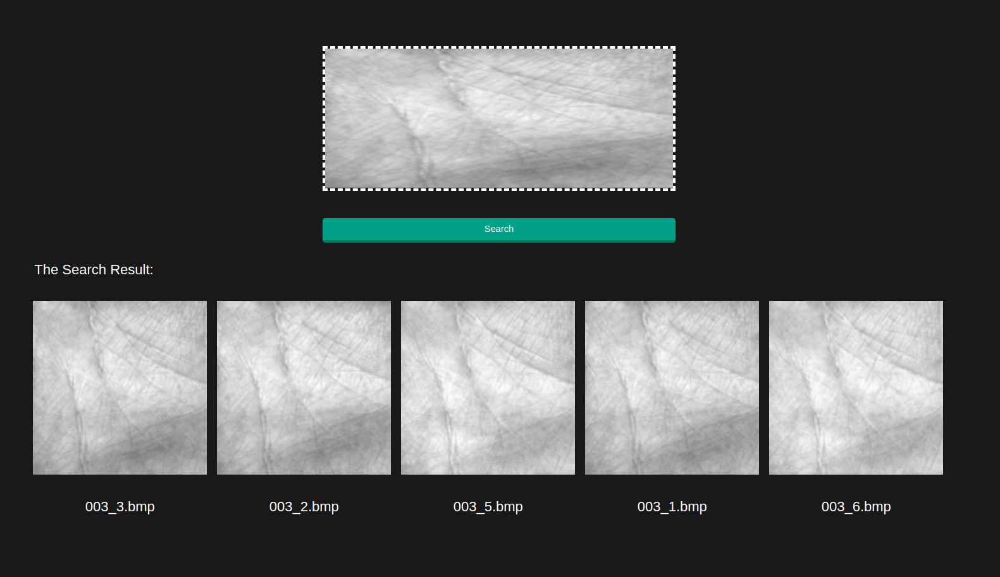
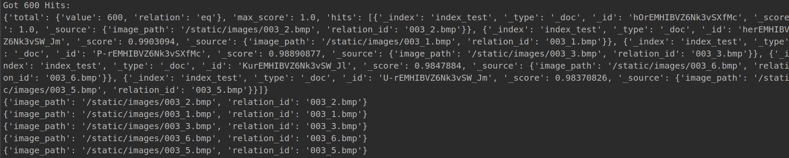

# search_images
search images by one image

## 本人开发环境配置：
1、Ubuntu 18.04

2、安装elasticsearch7.5.0， https://www.elastic.co/cn/downloads/elasticsearch
 或 https://blog.csdn.net/weixin_37281289/article/details/101483434

3、安装插件fast-elasticsearch-vector-scoring7.5.0， https://github.com/lior-k/fast-elasticsearch-vector-scoring

4、python 3.7.5

## 运行：
1、启动elasticsearch

2、将图片放入/static/images/中，然后跑python3 migrate.py进行建库与保存图片特征

3、python3 app.py

4、打开 http://127.0.0.1:5000/ ，然后进行测试

## 示例
todo: add test_url

掌纹识别：

## 准确率结果
五中三以上（100类图片，每类6张，每类一张去找其它五张，至少三张正确，才算正确。):

 模型  | 百次查找平均准确率  | 特征量len(feature.flatten()) | 百次查找耗时
 ---- | ----- | ------ | ------ 
 原图  | 0.66 | 16384  | 0.708s
 alexnet  | 0.0 | 9216  | 23.296s
 vgg16  | 0.99 | 100352  | 74.461s
 resnet50  | 0.61 | 2048  | 174.080s
 densenet121  | 0.88 | 50176 | 321.238s
 另：gabor  | 0.94 | 16384  | 2.128s
 另：gabor-hamming | 0.87 | -  | -
 

感觉应该是哪里出问题了，难道是因为densenet121与resnet50输出的特征量少，
我是用相识的图片去测试，不易区分。